### Hey, I'm Michelle

Full-stack builder at the intersection of AI and product, based in Austin, TX. I ship practical tools fast and learn in public.

  <picture>
    <source media="(prefers-color-scheme: light)" srcset="./assets/stats-light.svg" />
    
  </picture>

**Tech Stack**

**Currently building:**
- Claude Code plugins and skills that keep AI-assisted codebases clean
- Small native Mac apps with Tauri, Rust, and Swift
- AI agents for everyday chores, like turning a meal plan into a grocery cart
- Monitoring that diagnoses problems and opens the fix as a pull request

**Pinned:**
<!-- PINS:START -->
<!-- generated weekly — do not edit by hand -->
- [meta-doctor](https://github.com/michellemayes/meta-doctor) — Monitoring that writes the fix
- [terrarium](https://github.com/michellemayes/terrarium) — A tiny glass box for your React components
- [magic-words](https://github.com/michellemayes/magic-words) — The phrase that steers Claude
- [vibe-tooling](https://github.com/michellemayes/vibe-tooling) — Tidy-up tools for vibe-coded repos
- [nootle](https://github.com/michellemayes/nootle) — Lightweight macOS meeting recorder with live transcription and AI summaries
- [heb-grocery-agent](https://github.com/michellemayes/heb-grocery-agent) — Paste a list, get a full H-E-B cart
<!-- PINS:END -->

[michellemayes.me](https://michellemayes.me) · [LinkedIn](https://linkedin.com/in/michellejmayes) · [X](https://twitter.com/michellejmayes)
